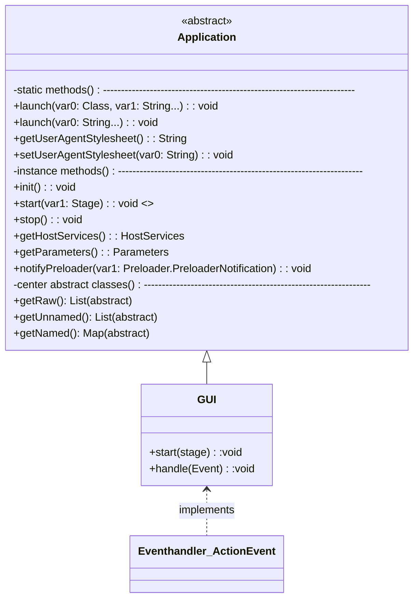

```mermaid
classDiagram
%% === Benutzer & Rollen === 

    class Application{
        <<abstract>>

        -static methods()----------------------------------------------------------------------
        +launch(var0: Class<? extends Application>, var1: String...): void
        +launch(var0: String...): void
        +getUserAgentStylesheet(): String
        +setUserAgentStylesheet(var0: String): void
        -instance methods()--------------------------------------------------------------------
        +init(): void
        +start(var1: Stage): void <<abstract>>
        +stop(): void
        +getHostServices(): HostServices
        +getParameters(): Parameters
        +notifyPreloader(var1: Preloader.PreloaderNotification): void
        -center abstract classes()---------------------------------------------------------------
        +getRaw(): List<String> (abstract)
        +getUnnamed(): List<String> (abstract)
        +getNamed(): Map<String, String> (abstract)


    }

    Application <|-- GUI
    
    class GUI{
    
    +start(stage):void
    +handle(Event):void
    
    
    }
    
GUI <.. Eventhandler_ActionEvent : implements

    class Eventhandler_ActionEvent{
        
 }
```