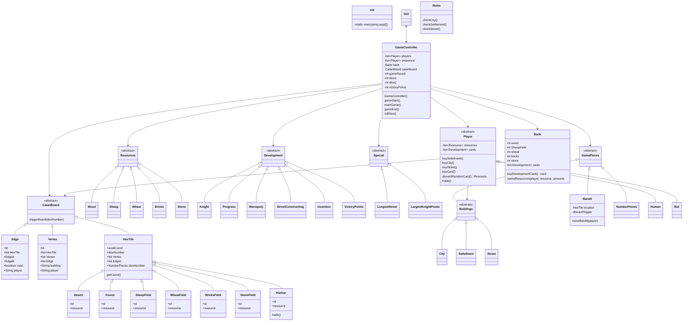

```mermaid
classDiagram
    %% === Benutzer & Rollen === 

    class Init {
        +static main(string args[])
    }   
    
    class GUI {
        
    }

    class GameController {
        -list~Player~ players
        -list~Player~ sequence
        -Bank bank
        -CatanBoard catanboard
        -int gameRound
        -int dice1
        -int dice2
        -int victoryPoints

        GameController()
        gameStart()
        mainGame()
        gameEnd()

        rollDice()
    }

    class Rules {
        checkCity()
        checkSettlement()
        checkStreet()
    }

    GUI <--> GameController
    GameController --> CatanBoard
    GameController --> Development
    GameController --> Special
    GameController --> Resources
    GameController --> GamePieces
    GameController --> Player
    GameController --> Bank

    class CatanBoard {
       <<abstract>>

       triggerBoard(diceNumber)
    }

    

    class Edge {
        +id
        +list HexTile
        +EdgeA
        +EdgeB
        +boolean road
        +String player
    }

    class Vertex {
        +id
        +list HexTile
        +list Vertex
        +list Edge
        +String building
        +String player
    }

    class HexTile {
        +axialCoord
        +diceNumber
        +list Vertex
        +list Edges
        +NumberPieces diceNumber

        getCoord()
    }

    class Desert {
        +id
        +resource
    }

    class Forest {
        +id
        +resource
    }

    class SheepField {
        +id
        +resource
    }

    class WheatField {
        +id
        +resource
    }

    class BricksField {
        +id
        +resource
    }

    class StoneField {
        +id
        +resource
    }
    
    class Harbor {
        +id
        +resource
        
        trade()
    }
    
    HexTile <|-- Desert
    HexTile <|-- Forest
    HexTile <|-- SheepField
    HexTile <|-- WheatField
    HexTile <|-- BricksField
    HexTile <|-- StoneField
    HexTile <|-- Harbor

    CatanBoard <|-- HexTile
    CatanBoard <|-- Edge
    CatanBoard <|-- Vertex


    class Resources {
        <<abstract>>
    }

    class Wood {

    }

    class Sheep {
        
    }

    class Wheat {
        
    }

    class Bricks {
        
    }
    
    class Stone {
        
    }

    Resources <|-- Wood
    Resources <|-- Sheep  
    Resources <|-- Wheat    
    Resources <|-- Bricks
    Resources <|-- Stone  
    
    class Development {
        <<abstract>>
    }
    
    class Knight {
        
    }
    
    class Progress {
   
    }
    
    class Monopoly {
   
    }
    
    class StreetConstructing {
   
    }
    
    class Invention {
   
    }
    
    class VictoryPoints {
     
    }
    
    Development <|-- Knight
    Development <|-- Progress
    Development <|-- Monopoly
    Development <|-- StreetConstructing
    Development <|-- Invention
    Development <|-- VictoryPoints
    
    
    class Special {
        <<abstract>>
    }
    
    class LongestStreet {
   
    }
    
    class LargestKnightPower {
   
    }
    
    Special <|-- LongestStreet
    Special <|-- LargestKnightPower
    
    

    class GamePieces {
        <<abstract>>
    }
    
    
    class Buildings {
        <<abstract>>
    }
    
    class City {
   
    }
    
    class Settelment {
   
    }
    
    class Street {
   
    }
    
    Buildings <|-- City
    Buildings <|-- Settelment
    Buildings <|-- Street

    
    class Bandit {
        -HexTile location
        -discardTrigger

        moveBandit(player)
    }
    
    class NumberPieces {
   
    }
    
    GamePieces <|-- Buildings
    GamePieces <|-- Bandit
    GamePieces <|-- NumberPieces
    
    
    
    class Player {
        <<abstract>>
        -list~Resource~ resources
        -list~Development~ cards

        buySettelment()
        buyCity()
        buyStreet()
        buyCard()
        discardRandomCard() Resource
        trade()
    }
    
    class Human {
   
    }
    
    class Bot {
   
    }
    
    Player <|-- Human
    Player <|-- Bot

    Player --> Buildings
    Player --> CatanBoard
    
    class Bank {
        int wood
        int SheepField
        int wheat
        int bricks
        int stone
        list~Development~ cards
        
        buyDevelopmentCard() card
        spendResources(player, resource, amount)
    }
```