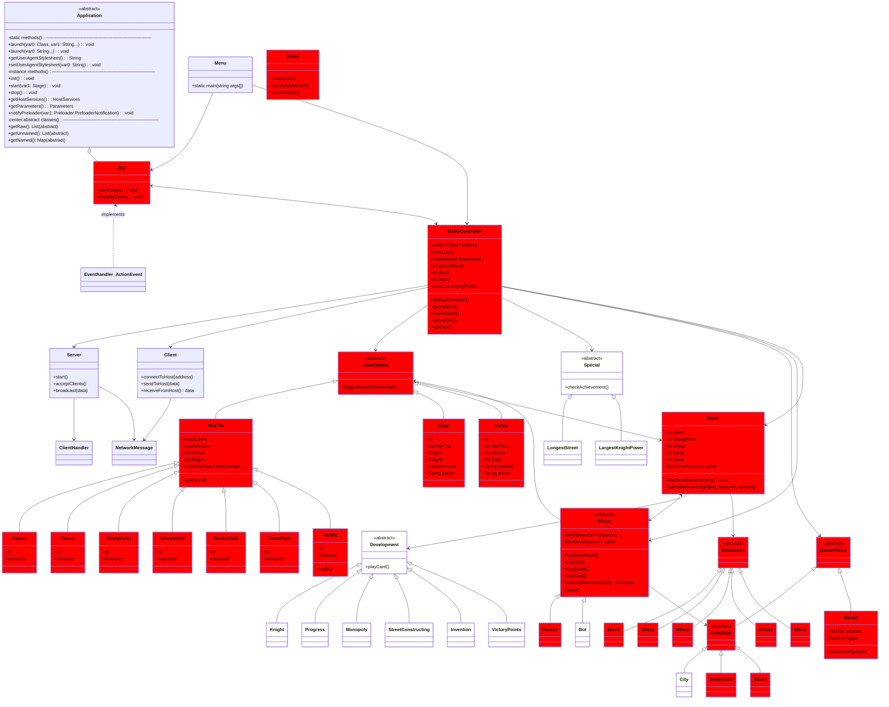

```mermaid

classDiagram
    class Menu {
        +static main(string args[])
    }

    class Application {
        <<abstract>>
        -static methods()----------------------------------------------------------------------
        +launch(var0: Class<? extends Application>, var1: String...): void
        +launch(var0: String...): void
        +getUserAgentStylesheet(): String
        +setUserAgentStylesheet(var0: String): void
        -instance methods()--------------------------------------------------------------------
        +init(): void
        +start(var1: Stage): void
        <<abstract>>
        +stop(): void
        +getHostServices(): HostServices
        +getParameters(): Parameters
        +notifyPreloader(var1: Preloader.PreloaderNotification): void
        -center abstract classes()---------------------------------------------------------------
        +getRaw(): List<String>(abstract)
        +getUnnamed(): List<String>(abstract)
        +getNamed(): Map<String, String>(abstract)
    }

    class GUI {
        +start(stage): void
        +handle(Event): void
    }

    GUI <.. Eventhandler_ActionEvent: implements

    class Eventhandler_ActionEvent {
    }

    class GameController {
        -array~Player~ players
        -Bank bank
        -CatanBoard catanboard
        -int gameRound
        -int dice1
        -int dice2
        -const int victoryPoints
        +GameController()
        +gameStart()
        +mainGame()
        +gameEnd()
        +rollDice()
    }

    class Rules {
        +checkCity()
        +checkSettlement()
        +checkStreet()
    }

    class CatanBoard {
        <<abstract>>
        +triggerBoard(diceNumber)
    }

    class Edge {
        +id
        +list HexTile
        +EdgeA
        +EdgeB
        +boolean road
        +String player
    }

    class Vertex {
        +id
        +list HexTile
        +list Vertex
        +list Edge
        +String building
        +String player
    }

    class HexTile {
        +axialCoord
        +diceNumber
        +list Vertex
        +list Edges
        +NumberPieces diceNumber
        +getCoord()
    }

    class Desert {
        +id
        +resource
    }

    class Forest {
        +id
        +resource
    }

    class SheepField {
        +id
        +resource
    }

    class WheatField {
        +id
        +resource
    }

    class BricksField {
        +id
        +resource
    }

    class StoneField {
        +id
        +resource
    }

    class Harbor {
        +id
        +resource
        +trade()
    }

    class Resources {
        <<abstract>>
    }

    class Wood {
    }

    class Sheep {
    }

    class Wheat {
    }

    class Bricks {
    }

    class Stone {
    }

    class Development {
        <<abstract>>
        +playCard()
    }

    class Knight {
    }

    class Progress {
    }

    class Monopoly {
    }

    class StreetConstructing {
    }

    class Invention {
    }

    class VictoryPoints {
    }

    class Special {
        <<abstract>>
        +checkAchievement()
    }

    class LongestStreet {
    }

    class LargestKnightPower {
    }

    class GamePieces {
        <<abstract>>
    }

    class Buildings {
        <<abstract>>
    }

    class City {
    }

    class Settelment {
    }

    class Street {
    }

    class Bandit {
        -HexTile location
        -discardTrigger
        moveBandit(player)
    }

    class Player {
        <<abstract>>
        -list~Resource~ resources
        -list~Development~ cards
        +buySettelment()
        +buyCity()
        +buyStreet()
        +buyCard()
        +discardRandomCard() Resource
        +trade()
    }

    class Human {
    }

    class Bot {
    }

    class Bank {
        -int wood
        -int SheepField
        -int wheat
        -int bricks
        -int stone
        -list~Development~ cards
        +buyDevelopmentCard() card
        +spendResources(player, resource, amount)
    }

    class NetworkMessage {
    }

    class Server {
        +start()
        +acceptClients()
        +broadcast(data)
    }
    class ClientHandler {
    }

    class Client {
        +connectToHost(address)
        +sendToHost(data)
        +receiveFromHost() data
    }
%% Relationshis

%% Inheritance
    Application <|-- GUI
    HexTile <|-- Desert
    HexTile <|-- Forest
    HexTile <|-- SheepField
    HexTile <|-- WheatField
    HexTile <|-- BricksField
    HexTile <|-- StoneField
    HexTile <|-- Harbor
    CatanBoard <|-- HexTile
    CatanBoard <|-- Edge
    CatanBoard <|-- Vertex
    Player <|-- Human
    Player <|-- Bot
    GamePieces <|-- Buildings
    GamePieces <|-- Bandit
    Buildings <|-- City
    Buildings <|-- Settelment
    Buildings <|-- Street
    Special <|-- LongestStreet
    Special <|-- LargestKnightPower
    Resources <|-- Wood
    Resources <|-- Sheep
    Resources <|-- Wheat
    Resources <|-- Bricks
    Resources <|-- Stone
    Development <|-- Knight
    Development <|-- Progress
    Development <|-- Monopoly
    Development <|-- StreetConstructing
    Development <|-- Invention
    Development <|-- VictoryPoints
%% Association
    Menu --> GUI
    Menu --> GameController
    GameController --> Server
    Server --> ClientHandler
    GameController --> Client
    Client --> NetworkMessage
    Server --> NetworkMessage
    
GUI <--> GameController
    GameController --> CatanBoard
    GameController --> Special
    GameController --> GamePieces
    GameController --> Player
    GameController --> Bank
    CatanBoard --> Bank
    Bank <--> Player
    Bank --> Development
    Bank --> Resources
    Player --> Buildings
    Player --> CatanBoard
%%Priority
    style Init fill: red
    style GUI fill: red
    style GameController fill: red
    style Rules fill: red
    style CatanBoard fill: red
    style Edge fill: red
    style Vertex fill: red
    style HexTile fill: red
    style Desert fill: red
    style Forest fill: red
    style SheepField fill: red
    style WheatField fill: red
    style BricksField fill: red
    style StoneField fill: red
    style Harbor fill: red
    style Resources fill: red
    style Wood fill: red
    style Sheep fill: red
    style Wheat fill: red
    style Bricks fill: red
    style Stone fill: red
    style Development fill: none
    style Knight fill: none
    style Progress fill: none
    style Monopoly fill: none
    style StreetConstructing fill: none
    style Invention fill: none
    style VictoryPoints fill: none
    style Special fill: none
    style LongestStreet fill: none
    style LargestKnightPower fill: none
    style GamePieces fill: red
    style Buildings fill: red
    style City fill: none
    style Settelment fill: red
    style Street fill: red
    style Bandit fill: red
    style Player fill: red
    style Human fill: red
    style Bot fill: none
    style Bank fill: red
    style NetworkManager fill: green
    style HostServer fill: green
    style ClientConnection fill: green

```

```
