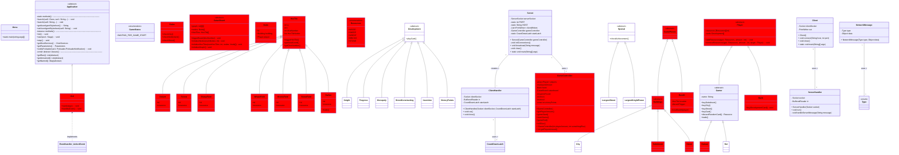

```mermaid

classDiagram
    class Menu {
        +static main(string args[])
    }

    class Application {
        <<abstract>>
        -static methods()----------------------------------------------------------------------
        +launch(var0: Class<? extends Application>, var1: String...): void
        +launch(var0: String...): void
        +getUserAgentStylesheet(): String
        +setUserAgentStylesheet(var0: String): void
        -instance methods()--------------------------------------------------------------------
        +init(): void
        +start(var1: Stage): void
        <<abstract>>
        +stop(): void
        +getHostServices(): HostServices
        +getParameters(): Parameters
        +notifyPreloader(var1: Preloader.PreloaderNotification): void
        -center abstract classes()---------------------------------------------------------------
        +getRaw(): List<String>(abstract)
        +getUnnamed(): List<String>(abstract)
        +getNamed(): Map<String, String>(abstract)
    }

    class GUI {
        +start(stage): void
        +handle(Event): void
    }

    GUI <.. Eventhandler_ActionEvent: implements

    class Eventhandler_ActionEvent {
    }
    
    class GameStates{
        <<enumeration>>
        +WAITING_FOR_GAME_START
    }

    class GameController {
        -array~Player~ players
        -int playerAmount
        -Bank bank
        -CatanBoard catanboard
        -int gameRound
        -int dice1
        -int dice2
        -const int victoryPoints
        +GameController()
        +getPlayerAmount()
        +gameStart()
        +mainGame()
        +gameEnd()
        +rollDice()
    }

    class Rules {
        +checkCity()
        +checkSettlement()
        +checkStreet()
    }

    class CatanBoard {
        <<abstract>>
        +graph: int[][][]
        +nodes: Node[]
        +HexTiles: HexTile[]
        +triggerBoard(diceNumber) void
        +initializeNodes(numNodes: int) void
        +initializeHexTiles(numHexTiles: int, nodes: Node[]) void
        +initializeGraph() void
    }

    class Node {
        +id
        +Building building
        +Player player
    }

    class HexTile {
        -int q
        -int r
        -int diceNumber
        -list HexTileNodes
        +triggerHexTile()
        +getAxialCoord()
        +getDiceNumber()
    }

    class Desert {
        +id
        +resource
    }

    class Forest {
        +id
        +resource
    }

    class SheepField {
        +id
        +resource
    }

    class WheatField {
        +id
        +resource
    }

    class BricksField {
        +id
        +resource
    }

    class StoneField {
        +id
        +resource
    }

    class Harbor {
        +id
        +resource
        +trade()
    }

    class Resources {
        <<enumeration>>
        +WOOD
        +SHEEP
        +WHEAT
        +BRICKS
        +STONE
    }

    class Development {
        <<abstract>>
        +playCard()
    }

    class Knight {
    }

    class Progress {
    }

    class Monopoly {
    }

    class StreetConstructing {
    }

    class Invention {
    }

    class VictoryPoints {
    }

    class Special {
        <<abstract>>
        +checkAchievement()
    }

    class LongestStreet {
    }

    class LargestKnightPower {
    }

    class GamePieces {
        <<abstract>>
    }

    class Buildings {
        <<abstract>>
    }

    class City {
    }

    class Settelment {
    }

    class Street {
    }

    class Bandit {
        -HexTile location
        -discardTrigger
        moveBandit(player)
    }

    class Player{
        <<abstract>>
        -resources [Resources][int]
        -cards Development[]
        +addResources(type: Resources, amount : int) : void
        +removeResources(type: Resources, amount : int, target : Player) : void
    }

    class Gamer {
        <<abstract>>
        -name: String
        +buySettelment()
        +buyCity()
        +buyStreet()
        +buyCard()
        +discardRandomCard() Resource
        +trade()
    }

    class Bank {
        +buyDevelopmentCard() card
    }

    class Human {
    }

    class Bot {
    }

    class Client {
        - Socket clientSocket
        - PrintWriter out
        + Client()
        + void connect(String host, int port)
        + void close()
        + static void main(String[] args)
    }

    class ServerHandler {
        - Socket socket
        - BufferedReader in
        + ServerHandler(Socket socket)
        + void run()
        - void handleServerMessage(String message)
    }

    class Server {
        - ServerSocket serverSocket
        - static int PORT
        - static String HOST
        - List~PrintWriter~ clientWriters
        - GameController gameController
        - static CountDownLatch startLatch
        + Server(GameController gameController)
        - void initConnections()
        + void broadcast(String message)
        - void close()
        + static void main(String[] args)
    }

    class ClientHandler {
        - Socket clientSocket
        - BufferedReader in
        - CountDownLatch startLatch
        + ClientHandler(Socket clientSocket, CountDownLatch startLatch)
        + void run()
        + void close()
    }

    class NetworkMessage {
        - Type type
        - Object data
        + NetworkMessage(Type type, Object data)
    }

    class Type {
        <<enum>>
    }

    class GameController {
        + GameController(int playerAmount, int somethingElse)
        + int getPlayerAmount()
    }

    Client "1" -- "1" ServerHandler : uses >
    Server "1" -- "*" ClientHandler : creates >
    Server "1" -- "1" GameController : uses >
    ClientHandler "1" -- "1" CountDownLatch : uses >
    NetworkMessage "1" -- "1" Type : uses >

    

%% Relationshis

%% Inheritance
    Application <|-- GUI
    HexTile <|-- Desert
    HexTile <|-- Forest
    HexTile <|-- SheepField
    HexTile <|-- WheatField
    HexTile <|-- BricksField
    HexTile <|-- StoneField
    HexTile <|-- Harbor
    Player <|-- Gamer
    Player <|-- Bank
    Gamer <|-- Human
    Gamer <|-- Bot
    GamePieces <|-- Buildings
    GamePieces <|-- Bandit
    Buildings <|-- City
    Buildings <|-- Settelment
    Buildings <|-- Street
    Special <|-- LongestStreet
    Special <|-- LargestKnightPower
    Development <|-- Knight
    Development <|-- Progress
    Development <|-- Monopoly
    Development <|-- StreetConstructing
    Development <|-- Invention
    Development <|-- VictoryPoints

%%Priority
    style Init fill: red
    style GUI fill: red
    style GameController fill: red
    style Rules fill: red
    style CatanBoard fill: red
    style Node fill: red
    style HexTile fill: red
    style Desert fill: red
    style Forest fill: red
    style SheepField fill: red
    style WheatField fill: red
    style BricksField fill: red
    style StoneField fill: red
    style Harbor fill: red
    style Resources fill: red
    style Wood fill: red
    style Sheep fill: red
    style Wheat fill: red
    style Bricks fill: red
    style Stone fill: red
    style Development fill: none
    style Knight fill: none
    style Progress fill: none
    style Monopoly fill: none
    style StreetConstructing fill: none
    style Invention fill: none
    style VictoryPoints fill: none
    style Special fill: none
    style LongestStreet fill: none
    style LargestKnightPower fill: none
    style GamePieces fill: red
    style Buildings fill: red
    style City fill: none
    style Settelment fill: red
    style Street fill: red
    style Bandit fill: red
    style Player fill: red
    style Human fill: red
    style Bot fill: none
    style Bank fill: red
    style NetworkManager fill: green
    style HostServer fill: green
    style ClientConnection fill: green

```
